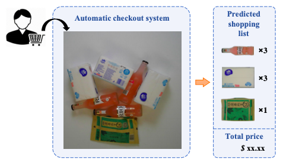

# product-detection-detectron2

This is my computer vision project which is about Large-Scale Retail Product Detection and Automatic Checkout. The dataset is present in this Kaggle challenge: 

1. [RPC: A Large-Scale Retail Product Checkout Dataset](https://www.kaggle.com/diyer22/retail-product-checkout-dataset)



Until Streamlit will allow users to deploy models (files) hosted by Git LFS to get mu URL Web APP, you can test it yourself!

## Try it yourself!

1. Install requirements:
```pip install -r https://github.com/feryah/product-detection-detectron2/blob/master/requirements.txt```
A file that includes necessary packages for this project.

2. Clone this repository:
```git clone https://github.com/feryah/product-detection-detectron2.git```

3. Once both the requirements are installed and the repository cloned, ```cd product-detection-detectron2``` 
4. Run the app:
```streamlit run app.py```. You're good to go!


## See the demo!


